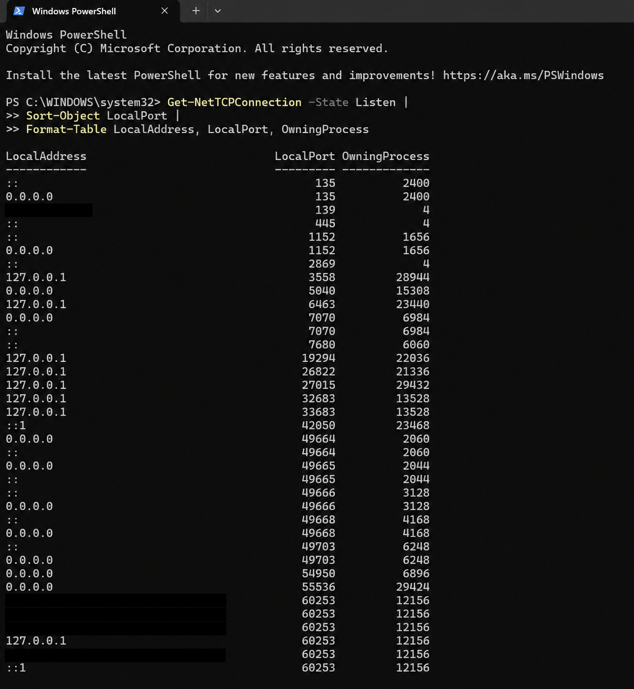
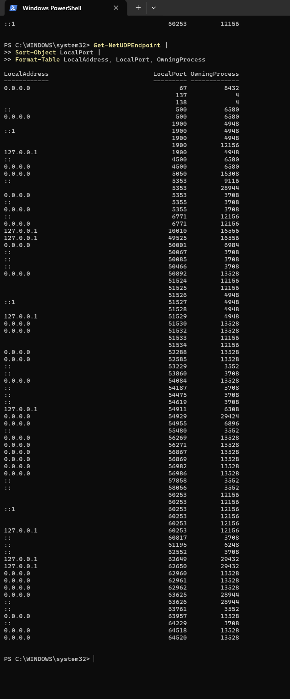
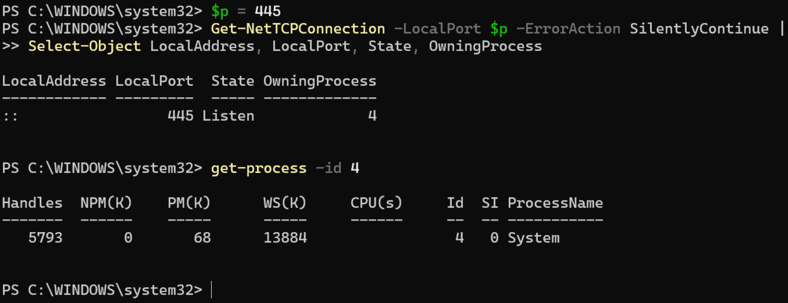
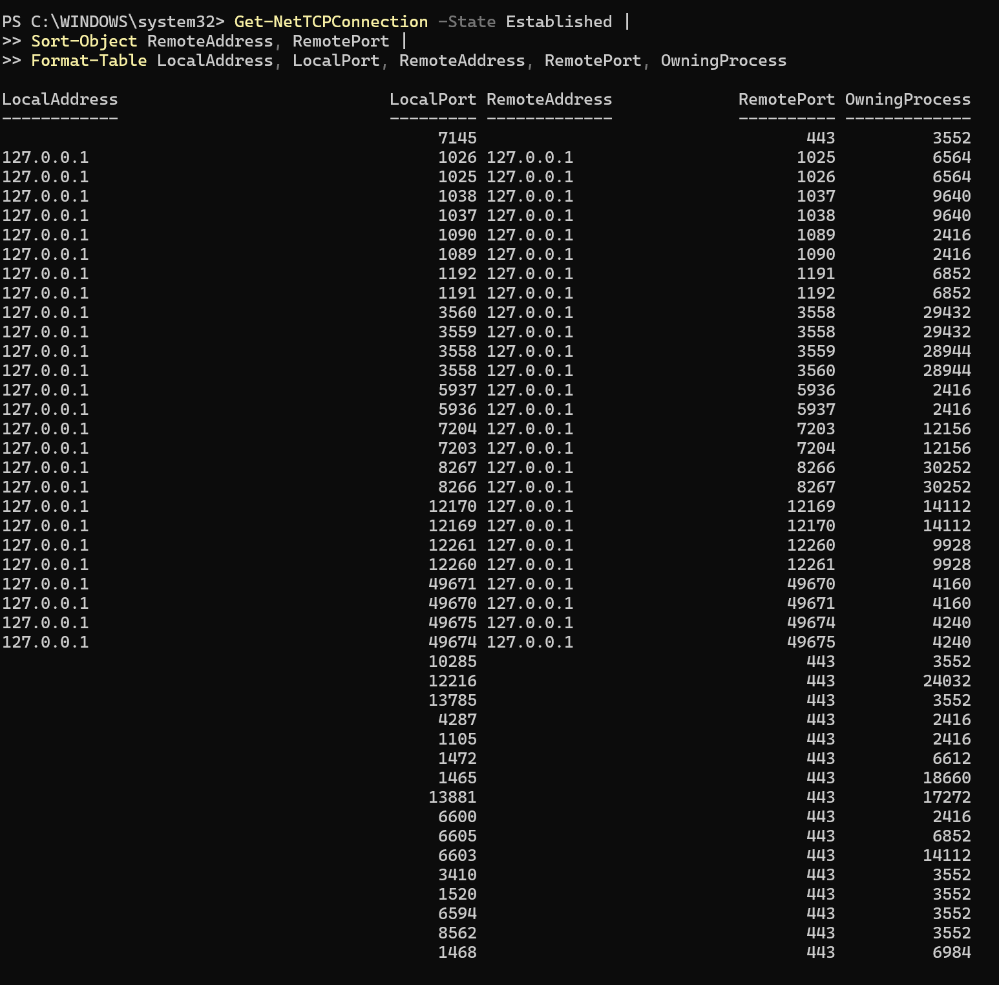

# Windows Port Inventory and Connection Analysis

## Objective

The objective of this exercise was to identify TCP listeners, UDP endpoints, active TCP connections, and their owning processes on a Windows 11 system.

The collected information was used to create and validate hypotheses about the services operating on selected ports.

## Environment

- Windows 11
- Windows PowerShell
- Home Wi-Fi network

## Tasks Completed

1. Identified local TCP listeners.
2. Identified local UDP endpoints.
3. Mapped a selected TCP port to its owning process.
4. Validated the service associated with TCP port 445.
5. Examined established TCP connections.
6. Identified the components of a TCP 5-tuple.
7. Summarized the observed ports, processes, interfaces, and service hypotheses.

## TCP Listener Inventory

The following command was used to display TCP ports in the `Listen` state:

```powershell
Get-NetTCPConnection -State Listen |
    Sort-Object LocalPort |
    Format-Table LocalAddress, LocalPort, OwningProcess
```

A TCP listener indicates that a process is waiting for incoming connection attempts on a local port.

The `LocalAddress` field shows which network interface can accept the connection:

- `0.0.0.0` - all appropriate IPv4 interfaces;
- `::` - all appropriate IPv6 interfaces;
- `127.0.0.1` - the local IPv4 loopback interface only;
- `::1` - the local IPv6 loopback interface only;
- a specific local address - a selected network interface.

A listening port does not automatically mean that the service is accessible from the Internet. Firewall rules, router configuration, network interfaces, and service permissions must also be considered.



## UDP Endpoint Inventory

The following command was used to display local UDP endpoints:

```powershell
Get-NetUDPEndpoint |
    Sort-Object LocalPort |
    Format-Table LocalAddress, LocalPort, OwningProcess
```

UDP does not use connection states such as `Listen` or `Established`. A UDP endpoint means that an application has bound a local port and can send or receive datagrams.

Unlike TCP, UDP does not:

- establish a connection using a three-way handshake;
- provide transport-layer acknowledgements;
- automatically retransmit lost datagrams;
- guarantee delivery or packet ordering.

The same numerical port can be used independently by TCP and UDP because they are separate transport protocols.



## Port-to-Process Mapping

TCP port 445 was selected for process identification:

```powershell
$p = 445

Get-NetTCPConnection -LocalPort $p -ErrorAction SilentlyContinue |
    Select-Object LocalAddress, LocalPort, State, OwningProcess
```

The result showed that TCP port 445 was in the `Listen` state and was owned by PID 4.

The owning process was identified using:

```powershell
Get-Process -Id 4
```

PID 4 was mapped to the Windows `System` process.

Because TCP port 445 is commonly associated with Server Message Block communication, the initial service hypothesis was SMB.

The hypothesis was checked using:

```powershell
Get-Service LanmanServer
```

The `LanmanServer` service was running. SMB2 support was then checked using:

```powershell
Get-SmbServerConfiguration |
    Select-Object EnableSMB2Protocol
```

The result showed that SMB2 was enabled. The process mapping, running service, and SMB configuration supported the SMB service hypothesis.



## Active TCP Connections

The following command was used to display established TCP connections:

```powershell
Get-NetTCPConnection -State Established |
    Sort-Object RemoteAddress, RemotePort |
    Format-Table LocalAddress, LocalPort, RemoteAddress, RemotePort, OwningProcess
```

The `Established` state indicates that the TCP three-way handshake was completed and that the connection was active when the command was executed.

Some connections used the loopback address `127.0.0.1`. These represented local communication between processes running on the same computer.

Other connections used remote TCP port 443, which is commonly associated with encrypted HTTPS/TLS communication.

Port numbers alone do not provide complete service identification. The owning process, connection state, remote endpoint, and captured network traffic should also be considered.



### TCP 5-Tuple Analysis

A TCP network flow can be identified using five values:

1. transport protocol;
2. local IP address;
3. local port;
4. remote IP address;
5. remote port.

The process ID is useful for identifying the application responsible for a connection, but it is not part of the 5-tuple.

## Results Summary

| Port / Transport | State | Process | Interface | Service Hypothesis | Validation Method |
|---|---|---|---|---|---|
| TCP 445 | Listen | System (PID 4) | All appropriate IPv6 interfaces (`::`) | SMB server | Process mapping, `LanmanServer` status, and SMB2 configuration |
| UDP 5353 | UDP endpoint | Multiple processes (PIDs vary) | Multiple local interfaces | mDNS / service discovery | UDP endpoint inspection and process mapping |
| TCP 443 (remote) | Established | Multiple processes (PIDs vary) | Local IPv4 and IPv6 interfaces | HTTPS/TLS | Established connection analysis and related Wireshark evidence |

## Conclusion

The exercise demonstrated how PowerShell can inventory TCP listeners, UDP endpoints, established TCP connections, and their owning processes.

TCP port 445 was mapped to the Windows `System` process. The running `LanmanServer` service and enabled SMB2 protocol supported the conclusion that the listener was associated with SMB.

UDP port 5353 was consistent with mDNS-based service discovery. Established connections to remote TCP port 443 were consistent with encrypted HTTPS/TLS communication.

The analysis demonstrated that a port number alone is not sufficient to identify a service with certainty. A reliable conclusion should consider the transport protocol, local interface, connection state, owning process, service configuration, and additional validation results.

## Security and Privacy

Screenshots were reviewed before publication. Network addresses that could disclose information about the tested environment were masked where necessary. Authentication data, usernames, device names, and other identifying information were not included.

Process IDs, active connections, and ephemeral ports are dynamic and may change between system restarts or repeated command executions.

[Back to module](../README.md)

